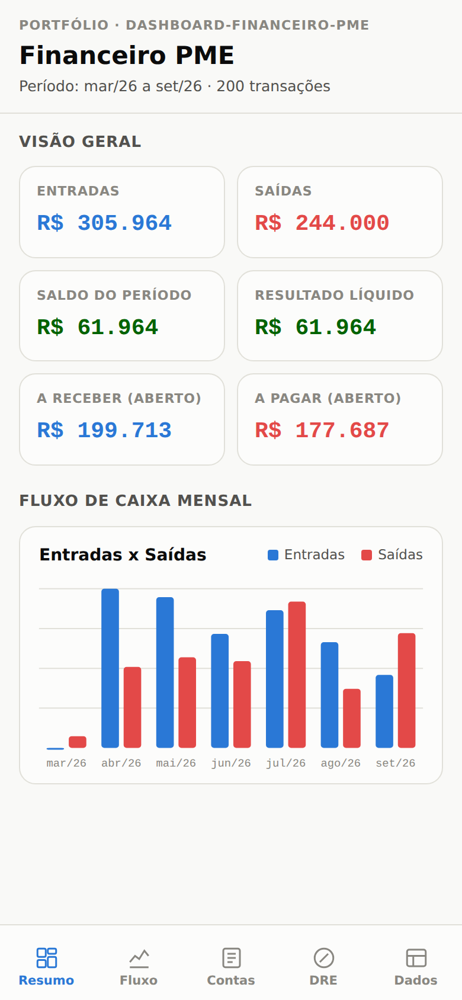
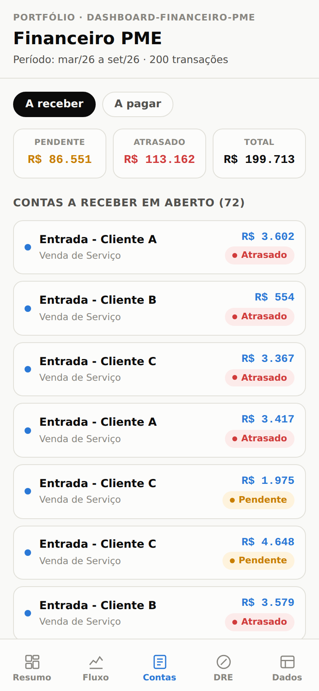
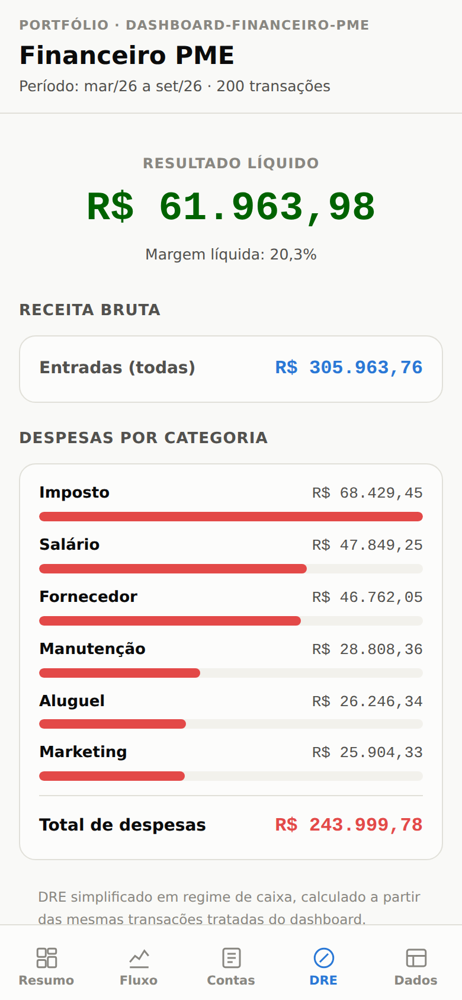

# Dashboard Financeiro para Pequena Empresa/Prestador de Serviço

Projeto de portfólio: simula o fluxo real de um trabalho de análise de dados
para um pequeno negócio — receber um export "cru" de um sistema financeiro,
identificar e tratar inconsistências, e transformar isso em um dashboard
gerencial (fluxo de caixa, contas a pagar/receber, DRE simplificado).

**Publicado em [dashboard-financeiro-pme.vercel.app](https://dashboard-financeiro-pme.vercel.app)**
— atualiza sozinho a cada push na `main`.

<p align="center">
  
  
  
</p>

## Por que esse projeto

A maioria dos portfólios mostra só o resultado bonito (o dashboard pronto).
Aqui o objetivo é mostrar o **processo inteiro**, incluindo a parte que mais
separa um profissional júnior de um sênior: lidar com dado sujo, do jeito
que ele realmente chega de um sistema real.

## Estrutura

```
.
├── README.md
├── requirements.txt
├── docs/               -> screenshots usados neste README
├── data/
│   ├── raw/           -> transacoes_brutas.csv (dado "sujo", simulando export de sistema)
│   └── processed/     -> transacoes_tratadas.csv (dado limpo, pronto para o dashboard)
├── scripts/
│   ├── gerar_dados.py          -> gera a base fake com inconsistências propositais
│   ├── tratar_dados.py         -> lê o dado bruto, aplica limpeza, gera relatório de qualidade
│   ├── gerar_dashboard.py      -> monta o dashboard final em Excel a partir do dado tratado
│   ├── gerar_dashboard_html.py -> monta a versão HTML (mobile) do dashboard
│   └── dashboard_template.html -> esqueleto HTML/CSS/JS usado pelo script acima
├── dashboard/
│   └── dashboard_financeiro.xlsx -> dashboard gerencial (Resumo, Fluxo Mensal, Contas a Pagar/Receber, DRE)
└── public/
    └── index.html      -> versão HTML (mobile) do dashboard — é o que o Vercel publica (Root Directory = public)
```

## O cenário simulado

Uma base de ~200 transações financeiras de uma pequena empresa fictícia,
com até 6 meses de histórico a partir da data de geração (`gerar_dados.py`
sorteia cada data em uma janela de 0 a 180 dias atrás), contendo os
seguintes problemas propositais (comuns em exports reais de sistemas):

| Problema simulado                              | % das linhas afetadas |
|-------------------------------------------------|------------------------|
| Erros de digitação/espaços na categoria          | ~10%                   |
| Datas em formato texto (dd/mm/aaaa) misturado com timestamp | ~8%       |
| Sinal de valor invertido em transações de saída  | ~5%                    |
| Status de pagamento em branco                    | ~4%                    |

## Como rodar

```bash
pip install -r requirements.txt

cd scripts
python gerar_dados.py           # gera data/raw/transacoes_brutas.csv
python tratar_dados.py          # gera data/processed/transacoes_tratadas.csv
python gerar_dashboard.py       # gera dashboard/dashboard_financeiro.xlsx
python gerar_dashboard_html.py  # gera public/index.html
```

O `tratar_dados.py` imprime um relatório de qualidade de dados ao final,
mostrando exatamente quantas linhas foram corrigidas em cada etapa — essa é
a evidência de que o pipeline está funcionando, não só "rodando sem erro".

### Exemplo de saída do relatório

```
=== Relatório de Qualidade de Dados ===
Linhas na base bruta:              200
Categorias corrigidas:              20
Datas reformatadas/padronizadas:    16
Linhas removidas (data inválida):   0
Sinais de valor corrigidos:         4
Status vazios preenchidos:          8
Linhas na base final tratada:       200
```

## Decisões de tratamento (e por quê)

- **Categorias**: normalizadas via `.str.strip()` + mapa de correção, unificando
  variações como `"Alugue"`, `"alugue "` → `"Aluguel"`.
- **Datas**: a coluna vinha com dois formatos simultâneos (timestamp ISO e
  texto `dd/mm/aaaa`, padrão brasileiro), então cada um é parseado
  separadamente com seu próprio formato explícito — ver bug #4 abaixo, é o
  motivo de não dar pra resolver isso com uma chamada só de
  `pd.to_datetime`.
- **Valores negativos em "Saída"**: convertidos para positivo. A direção do
  fluxo (entrada/saída) já é representada pela coluna `tipo` — um valor
  negativo ali é sempre erro de lançamento, não uma "saída de verdade".
- **Status vazio**: preenchido com `"Não informado"` em vez de descartado —
  perder uma transação real por falta de status seria pior do que só marcar
  a lacuna.

## O dashboard (Excel)

Gerado por `scripts/gerar_dashboard.py` a partir de `transacoes_tratadas.csv`,
em `dashboard/dashboard_financeiro.xlsx`, com 5 abas:

- **Resumo** — capa com KPIs (entradas, saídas, saldo, contas a receber/pagar
  em aberto, resultado líquido) e o gráfico de fluxo de caixa mensal.
- **Fluxo Mensal** — entradas, saídas, saldo do mês e saldo acumulado por mês,
  com gráfico de barras (entradas x saídas) e linha (saldo acumulado).
- **Contas a Pagar e Receber** — resumo de valores em aberto por status
  (Pendente/Atrasado) e o detalhamento linha a linha de cada conta.
- **DRE** — receita bruta, despesas por categoria e resultado líquido, com
  gráfico de despesas por categoria.
- **Dados** — a base tratada completa, como Tabela do Excel (filtro embutido).

**Os totais e KPIs são fórmulas do Excel (`SUMIFS`), não valores fixos** —
apontam para a aba Dados, então editar uma transação ali recalcula o resto
do arquivo automaticamente. As duas listas de "em aberto" (Contas a
Pagar/Receber) são um extrato tirado da base no momento em que o script
roda; para atualizá-las depois de mudar os dados, é só rodar
`gerar_dashboard.py` de novo — mesma lógica de reprodutibilidade dos outros
dois scripts do pipeline.

Paleta e critérios de cor seguem uma referência de data-viz: azul para
entradas, vermelho para saídas/despesas, e uma paleta de status reservada
(amarelo = pendente, vermelho = atrasado, verde = positivo) nunca reutilizada
para outra coisa. Os dois gráficos que comparam entradas/saídas com o saldo
acumulado ficam em eixos separados (grandezas muito diferentes) em vez de um
gráfico de eixo duplo.

## O dashboard (HTML, mobile)

`scripts/gerar_dashboard_html.py` gera uma segunda versão do dashboard como
página única e autocontida (`public/index.html`), pensada para abrir direto
no celular por um link — sem precisar de Excel instalado.
Mesmas 5 visões da versão em planilha (Resumo, Fluxo Mensal, Contas a
Pagar/Receber, DRE, Dados), como abas de navegação fixas na parte de baixo
da tela, no estilo de um app:

- KPIs, gráficos (entradas x saídas por mês, saldo acumulado) e listas são
  calculados em JavaScript a partir das mesmas transações tratadas,
  embutidas como JSON na página — mesmo princípio de "uma fonte de
  verdade" das fórmulas `SUMIFS` da versão em Excel, só que recalculado no
  navegador em vez de pelo Excel.
- Gráficos são SVG desenhado à mão (sem biblioteca de gráficos), com toque
  para ver valores exatos.
- Layout responsivo mobile-first, com tema claro/escuro automático
  (segue a preferência do aparelho).
- Aba "Dados" tem busca e filtro por tipo (entrada/saída) sobre as 200
  transações.

`dashboard_template.html` guarda o HTML/CSS/JS; o script só troca o
marcador dos dados pelo JSON gerado a partir do CSV tratado — reexecutar
`gerar_dashboard_html.py` depois de mudar os dados regenera a página
inteira.

## Bugs reais encontrados no processo

Vale registrar porque são evidência de depuração real, não só "rodou sem erro":

1. **Ordem `strip` → `replace` na correção de categoria** — corrigir com
   `.replace()` antes de `.str.strip()` deixava variações como `"fornecedor "`
   escaparem da correção, porque a chave do mapa (`"fornecedor"`) não batia
   com o valor sujo com espaço. A ordem certa é limpar espaços primeiro.
2. **Pandas revertendo `dd/mm/aaaa` de volta para `Timestamp`** — atribuir uma
   string diretamente numa célula de uma coluna já `datetime64` faz o pandas
   "corrigir" sozinho e reconverter para `Timestamp`, apagando a sujeira antes
   mesmo dela existir. Precisou converter a coluna inteira para `dtype
   object` antes de sujar as datas.
3. **Relatório de qualidade contando 100% das linhas como "data reformatada"**
   — a normalização de hora (`.dt.normalize()`) alterava o valor de toda
   coluna, então uma comparação ingênua "mudou = foi reformatada" contava
   todas as 200 linhas, mascarando o número real (~8%, só as que vieram como
   texto). A correção foi marcar quais linhas eram texto **antes** do parse,
   não comparar o resultado depois.
4. **`dayfirst=True` trocando mês por dia até em timestamp ISO** — o mais sério
   dos quatro, e o mais difícil de perceber: `pd.to_datetime(coluna,
   format="mixed", dayfirst=True)` deveria só resolver a ambiguidade do texto
   `dd/mm/aaaa`, mas o `dayfirst` "vazava" pro formato ISO também — sempre que
   dia e mês eram os dois ≤12, `"2026-05-08"` (8 de maio) virava
   `"2026-08-05"` (5 de agosto). Isso bagunçava **39% das linhas com
   timestamp** (72 de 184), silenciosamente — sem erro, sem warning, só data
   errada. Só apareceu porque o intervalo de datas do dashboard não batia com
   os "6 meses" esperados (dava quase 12). A correção foi abandonar o parse
   único com `format="mixed"` e tratar ISO e `dd/mm/aaaa` como duas chamadas
   separadas, cada uma com o formato explícito — `dayfirst` só faz sentido
   pro texto ambíguo, nunca pro timestamp ISO (que já é ano-primeiro,
   inequívoco).
5. **Categoria e contraparte sorteadas sem relação com o tipo da transação**
   — `gerar_dados.py` sorteava `categoria` (e o cliente/fornecedor da
   descrição) de forma totalmente independente de `tipo`, então qualquer
   uma das 7 categorias podia cair tanto em Entrada quanto em Saída. O
   efeito não era só "esquisito nos dados": a aba DRE chegou a mostrar
   **"Venda de Serviço" como categoria de despesa**, e a lista de contas
   mostrava linhas como "Entrada - Fornecedor Y" (dinheiro entrando vindo
   de um fornecedor). Só ficou óbvio olhando o dashboard renderizado, não
   examinando o CSV coluna por coluna. A correção foi amarrar a lógica ao
   tipo: toda Entrada é `"Venda de Serviço"` com um cliente como
   contraparte, toda Saída sorteia entre as 6 categorias de despesa reais
   com um fornecedor como contraparte — e `CATEGORIAS_DESPESA`, em
   `gerar_dashboard.py`, parou de incluir "Venda de Serviço" na soma de
   despesas do DRE.

## Stack

Python 3, pandas, openpyxl.
